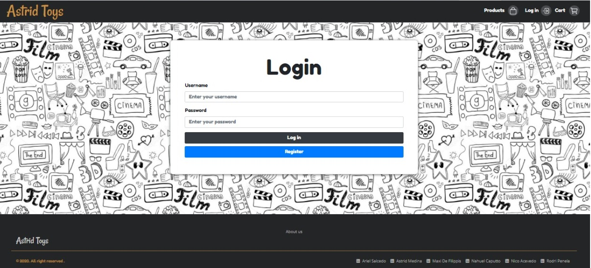
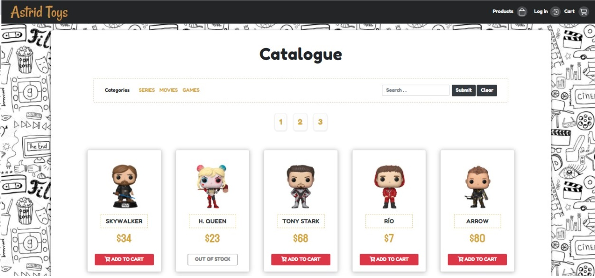

This project was bootstrapped with [Create React App](https://github.com/facebook/create-react-app).

## Available Scripts

In the project directory, you can run:

### `yarn start`

Runs the app in the development mode.<br />
Open [http://localhost:3000](http://localhost:3000) to view it in the browser.

The page will reload if you make edits.<br />
You will also see any lint errors in the console.

### `yarn test`

Launches the test runner in the interactive watch mode.<br />
See the section about [running tests](https://facebook.github.io/create-react-app/docs/running-tests) for more information.

### `yarn build`

Builds the app for production to the `build` folder.<br />
It correctly bundles React in production mode and optimizes the build for the best performance.

The build is minified and the filenames include the hashes.<br />
Your app is ready to be deployed!

See the section about [deployment](https://facebook.github.io/create-react-app/docs/deployment) for more information.

### `yarn eject`

**Note: this is a one-way operation. Once you `eject`, you can’t go back!**

If you aren’t satisfied with the build tool and configuration choices, you can `eject` at any time. This command will remove the single build dependency from your project.

Instead, it will copy all the configuration files and the transitive dependencies (webpack, Babel, ESLint, etc) right into your project so you have full control over them. All of the commands except `eject` will still work, but they will point to the copied scripts so you can tweak them. At this point you’re on your own.

You don’t have to ever use `eject`. The curated feature set is suitable for small and middle deployments, and you shouldn’t feel obligated to use this feature. However we understand that this tool wouldn’t be useful if you couldn’t customize it when you are ready for it.

## Learn More

You can learn more in the [Create React App documentation](https://facebook.github.io/create-react-app/docs/getting-started).

To learn React, check out the [React documentation](https://reactjs.org/).

### Code Splitting

This section has moved here: https://facebook.github.io/create-react-app/docs/code-splitting

### Analyzing the Bundle Size

This section has moved here: https://facebook.github.io/create-react-app/docs/analyzing-the-bundle-size

### Making a Progressive Web App

This section has moved here: https://facebook.github.io/create-react-app/docs/making-a-progressive-web-app

### Advanced Configuration

This section has moved here: https://facebook.github.io/create-react-app/docs/advanced-configuration

### Deployment

This section has moved here: https://facebook.github.io/create-react-app/docs/deployment

### `yarn build` fails to minify

This section has moved here: https://facebook.github.io/create-react-app/docs/troubleshooting#npm-run-build-fails-to-minify


********************************************************************************************************

## Astrid Toys


_Online Shop_

E-commerce project in React and postgress.

# Preview


## Comenzando 🚀

_About Project_

See the section about [deployment](https://astridtoys.herokuapp.com/) for more information.


### Pre-requisitos 📋

_Que instalar y como instalarlas_

```
ejemplo?
```

### Instalación  🔧

_Pasos de lo que debes ejecutar para tener un entorno de desarrollo ejecutandose_

_como es el paso_

```
Ejemplo?
```

_repito_

```
finalizar
```

## Ejecutando las pruebas ⚙️

_como?_

### Analice las pruebas end-to-end 🔩

_Explica que verifican estas pruebas y por qué_

```
ejemplo
```

### Y las pruebas de estilo de codificación ⌨️

_Explica que verifican estas pruebas y por qué_

```
Da un ejemplo
```

## Despliegue 📦

_nota de como hacer deploy_

## Construido con 🛠️

_Menciona las herramientas que utilizaste para crear tu proyecto_

This project was created with:
* [Create React App](https://github.com/facebook/create-react-app).
* [Bootstrapped]("https://cdn.jsdelivr.net/npm/bootstrap@4.5.3/dist/css/bootstrap.min.css") - Framework web
* [Google Apis](https://fonts.googleapis.com/css2?family=Open+Sans:wght@300&family=Xanh+Mono&display=swap)
* [OTHER](https:// INSERT HERE /) - Use for
* [OTHER](https:// INSERT HERE /) - Use for 


## Wiki or other 📖

Puedes encontrar mucho más de cómo utilizar este proyecto en nuestra [Wiki](https://github.com/tu/proyecto/wiki)

## Versionado 📌

Usamos las versiones:

 * __Node__: 12.18.3 o mayor
 * __NPM__: 6.14.16 o mayor

Para verificar que versión tienen instalada:

> node -v
>
> npm -v


## Final Project





## Autores ✒️


Desde - *Trabajo Inicial* -  *Documentación* - *Planificación* - *Maquetado* -

* **Ariel Salcedo**  - [arielboyu](https://github.com/arielboyu)
* **Maxi de Filippis** - [maxidefilippisl](https://github.com/maxidefilippis)
* **Nico Acevedo** - [acevedonm](https://github.com/acevedonm)
* **Rodrigo Penela** - [Rodriip95](https://github.com/Rodriip95)
* **Astrid Medina** - [Sifrisky](https://github.com/Sifrisky)
* **Nahuel Caputto** - [nahuelcaputto](https://github.com/nahuelcaputto)


## Agradecimientos 🎁

* Estamos muy contentos con el desarrollo del proyecto y la finalización del mismo y queremos mostrarselos a todos 📢
* Los AstridBoys celebramos con una cerveza 🍺 el termino del proyecto.
* Agradecemos al stuff de Henry por ... 🤓.
* etc.


---

**Find us in Linkedin:**

"https://www.linkedin.com/in/ariel-salcedo-b423b61ba/"
"https://www.linkedin.com/in/astrid-medina/"
"https://www.linkedin.com/in/maxidf/"
"https://www.linkedin.com/in/nahuel-caputto-63132b32/"
"https://www.linkedin.com/in/nicolas-acevedo-b444a41b2/"
"https://www.linkedin.com/in/rodrigomanuelpenela"


⌨️ con ❤️ por [AstridBoys] para Henry (Agregar Linkedin) 😊


